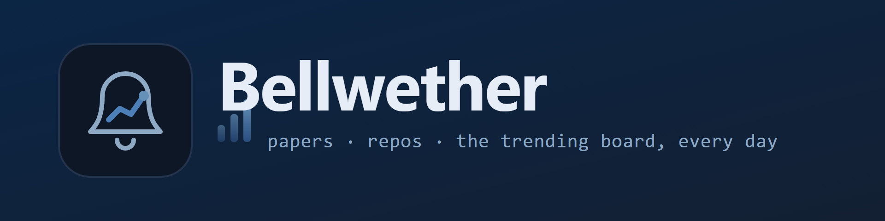
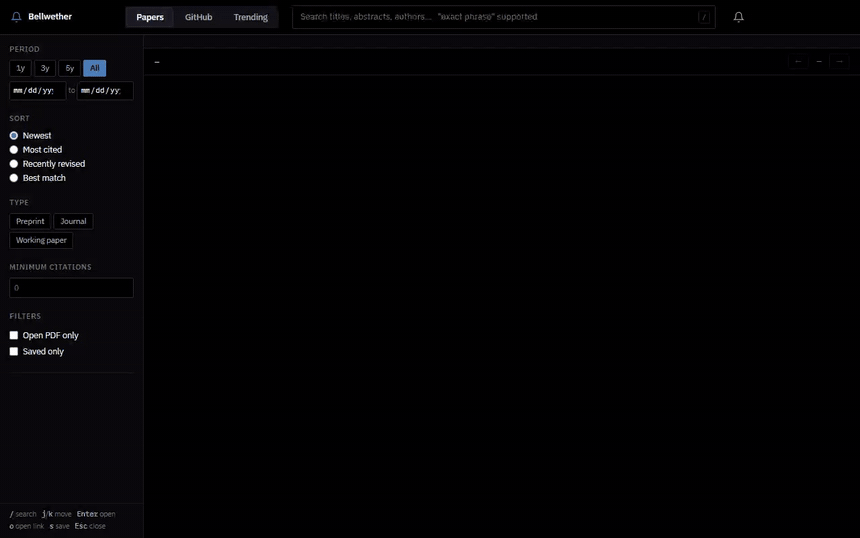
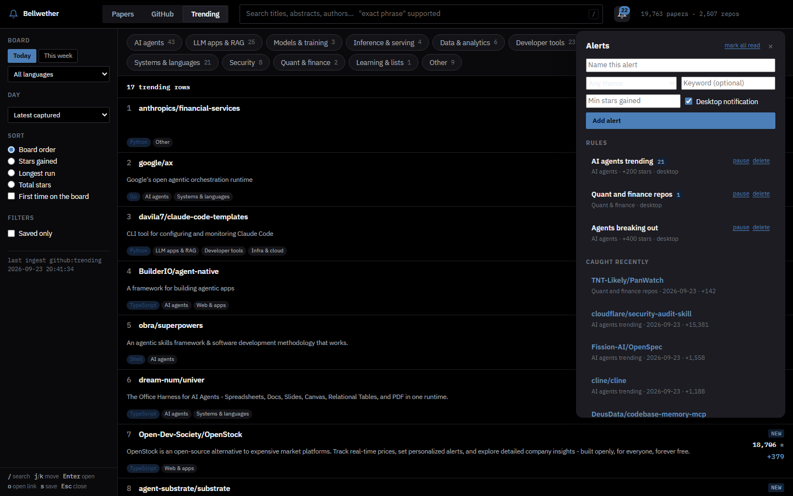

<p align="center">
  
</p>

<p align="center">
  
  
  
  <a href="https://arxiv.org/help/api/"></a>
  
  <a href="LICENSE"></a>
</p>

## What it is

Bellwether is a local research desk for quant finance. It keeps one searchable index of the papers, the repositories and the daily GitHub trending boards, so a search for "volatility" answers in all three, and tells you what moved this morning before anyone writes a newsletter about it.

Everything runs on your machine against free sources. No API key, no account, no paid data. Nothing is downloaded either: every result links out, and papers carry a badge saying whether a free PDF exists or only an abstract page does.

- **Papers.** arXiv and OpenAlex in one deduplicated table, with citation counts, open access status and twelve quant finance themes.
- **Repositories.** A watchlist built from those same themes, ranked by growth against each repository's own history rather than by raw stars.
- **Trending, every day.** Six GitHub boards captured daily and kept forever, classified into general themes such as AI agents, LLM apps, infra and security. What trended last Tuesday is still there next month.
- **Alerts.** Rules written in the interface, evaluated after each capture, delivered as a Windows notification and an unread count on the bell.

<p align="center">
  
</p>

## Quickstart

```
pip install -r requirements.txt
py -3 refresh.py --seed        # first run: fills the database, takes a while
py -3 serve.py                 # opens http://127.0.0.1:8077/
```

Then keep it current, which is what makes growth, runs on the board and alerts mean anything:

```
py -3 refresh.py --daily
powershell -ExecutionPolicy Bypass -File scripts\schedule_daily.ps1
```

GitHub ingestion reads its token from the `gh` CLI keyring (`gh auth token`), so no token is ever written into this project. arXiv and OpenAlex need nothing at all.

## Highlights

**The trending boards, kept.** GitHub shows you today and forgets yesterday. Bellwether captures the overall board, the weekly board and four language boards each day, stores every row, and counts how many days in a row a repository has held on. Sort by board order, by stars gained, by longest run or by total stars, filter by theme, or show only what has never been on a board before.

**Alerts you write in the interface.** A rule is a theme, a keyword, a minimum number of stars gained and a board. Hits are recorded once per repository per day, so a repository that trends all week notifies you once. Desktop notifications go through Windows directly, with no extra package, and anything that cannot pop is still waiting on the bell.

**Growth, measured honestly.** Raw star counts rank the same twenty famous repositories forever, so momentum is `stars_30d / log(1 + stars)`, which lets a 300 star repository adding 80 a month outrank a 40,000 star one adding 200. Repositories without enough history yet fall back to a lifetime average, labelled differently so the two are never confused.

**Papers and code in one index.** A repository that cites an arXiv id in its README is linked to that paper, so a paper's page lists its implementations and a repository's page lists the papers behind it.

## How it works

Ingestion and serving are separate. Scripts in `ingest/` write to a SQLite database; the API in `api/` only reads it. Every page load is a local index lookup, so the interface stays instant and works with no network.

```
config/themes.yaml            quant finance taxonomy: one block per theme, three matchers each
config/trending_themes.yaml   general taxonomy for the boards (AI agents, infra, security, ...)
db/schema.sql                 tables, FTS5 indexes
ingest/arxiv.py               arXiv Atom API, month-windowed backfill + incremental
ingest/openalex.py            citations by DOI, plus discovery of non-arXiv work
ingest/github.py              search, README fetch, star history, growth metrics
ingest/trending.py            the daily boards, parsed, enriched and classified
ingest/notify.py              alert rules and Windows notifications
ingest/classify.py            applies themes.yaml to everything
api/                          FastAPI, read-only
web/                          the interface, no build step
refresh.py                    one entry point for every ingest step
scripts/schedule_daily.ps1    registers the daily capture with Task Scheduler
```

## Sources and what each one is for

| Source | Role | Auth |
|---|---|---|
| arXiv | q-fin preprints plus finance-filtered cs.LG, stat.ML, econ.EM | none |
| OpenAlex | citation counts for everything with a DOI, and discovery of journal, SSRN, NBER and RePEc work that never reached arXiv | none, polite pool via email |
| GitHub API | repository metadata, star history, growth, topics for board rows | `gh` CLI keyring |
| github.com/trending | the daily boards, which have no API | none |

arXiv covers the maths, physics and CS side of quant finance. OpenAlex discovery is deliberately gated to the economics, finance and accounting subfields, because without that gate "microstructure" returns metallurgy, "transformer" returns electrical engineering and "drawdown" returns hydrology. The two sources divide the literature instead of fighting over it.

Trending boards are read from the public pages, which `robots.txt` leaves open, once a day per board with a crawl delay. Rows carry no topics, so each one is read once through the API, which is also what lets a genuinely finance repository on the board join the watchlist before anyone has topic-tagged it.

## Deduplication

A paper posted to arXiv and later published in a journal is one row, not two. Matching runs DOI first, then arXiv id, then title. Title matches need corroboration that scales with how distinctive the title is: a long title merges on its own, while a short one such as "Deep Hedging" also needs the same first author and a publication date within three years. Merging keeps the earliest date as publication, the latest as revision, the longer abstract, the fuller author list, any PDF found, and the union of both sources.

## Themes

Both taxonomies work the same way. Each theme has up to three matchers:

- `arxiv_cats` / `topics` exact arXiv category or GitHub topic
- `include` / `exclude` regex over title, abstract, description or README

A category or topic hit scores 1.0, a keyword hit 0.6. Assignment is rule-based on purpose: a wrong theme is fixed by editing one line and re-running, with no retraining and nothing hidden.

```
py -3 refresh.py --classify              papers and repos
py -3 ingest/trending.py --classify      the boards
```

`config/themes.yaml` also drives OpenAlex discovery, with search phrases expanded out of the `include` regexes, so the taxonomy stays the single source of truth.

## Growth ranking

`repo_snapshots` holds one row per repository per day. A spike flag fires when the week's gain sits more than three standard deviations above that repository's own weekly history.

**History cannot be backfilled on every account.** The intended shortcut was to sample the stargazers endpoint, whose entries carry `starred_at`, so two dozen sampled pages would reconstruct a whole curve. GitHub refuses that listing on this one: REST answers 404 for every repository (401 unauthenticated) and the GraphQL `stargazers` connection returns `stargazerCount` alongside zero edges, while the repository endpoint itself reads fine. `--backfill-stars` probes for this and says so rather than silently recording nothing.

So growth builds forward instead. Run the daily refresh and real 7d and 30d figures appear within a week. Until then the Growing sort falls back to lifetime average stars per day, shown as `~N/day avg` in muted text so it is never confused with measured growth.

## Keeping the modules honest

Every source needed a domain gate, for the same reason and with the same symptom: a term that is precise in one field is ambiguous in every other.

For papers, OpenAlex discovery is restricted to the economics, finance and accounting subfields.

For repositories, `repo_anchor` requires either an unambiguous topic or a finance term in the name, description or topics. Every term is word-anchored, because unanchored stems produced exactly the false positives you would expect: `defi` matched "model-definition" and pulled in huggingface/transformers, `quant` matched "quantization" and pulled in LlamaFactory, and `broker` matched "message broker" and pulled in redis. Each of those is now a regression test.

For the boards, a row joins the finance watchlist only when it passes that anchor **and** lands in the finance theme, because one signal alone is too loose on a general board: `swap` in a model-swapping tool and `portfolio` in someone's portfolio of projects both read as finance on their own.

Tightening a gate later is cheap: `--prune` re-applies the anchor to what is already stored, so the search quota already spent is not wasted.

## Commands

```
py -3 refresh.py --seed                      full backfill, every module
py -3 refresh.py --daily                     incremental, for the scheduler
py -3 refresh.py --trending                  today's boards + alert rules
py -3 refresh.py --classify                  reapply both taxonomies

py -3 ingest/arxiv.py --since 2015-01-01
py -3 ingest/openalex.py --enrich
py -3 ingest/openalex.py --discover --theme volatility-options
py -3 ingest/github.py --discover
py -3 ingest/github.py --prune               list repos failing the finance anchor
py -3 ingest/github.py --prune --apply       and remove them
py -3 ingest/github.py --daily               snapshot + metrics, run this daily
py -3 ingest/trending.py --daily             capture the boards
py -3 ingest/trending.py --show              print the last board captured
py -3 ingest/notify.py --add "Agents" --theme ai-agents --min-stars 300
py -3 ingest/notify.py --run                 evaluate the rules
py -3 ingest/notify.py --test                one desktop notification

py -3 tests/test_core.py                     offline, dedupe and normalization
py -3 tests/test_sources.py                  offline, the source adapters
py -3 tests/test_trending.py                 offline, board parsing and alerts
py -3 tests/test_api.py                      offline, every endpoint
node  tests/test_safeurl.mjs                 front-end URL scheme allowlist
```

## Interface

Filters live in the URL, so a search can be bookmarked and reopened exactly as it was.

Keyboard: `/` focus search, `j` and `k` move, `Enter` open detail, `o` open the source link, `s` save, `Esc` close.

Saving a paper keeps a note against it and can flag it as a reel candidate. Hiding one takes it out of every listing permanently, which is how the automatic GitHub watchlist stays clean without manual curation.

<p align="center">
  
</p>

## Limits

- **Trending is scraped, not an API.** GitHub publishes no trending endpoint. Parsing reads the page by meaning rather than by class name, and a layout change is reported rather than swallowed, but it is still a page that can change.
- **Board rows are shallow.** Name, description, language and a star count are all a board gives, so each row is enriched through the API before it is classified. With enrichment capped, a busy day can leave a few rows classified on their description alone.
- **Themes are rules, not judgement.** Anything that matches nothing lands in "other", which is the first place to look when a theme needs widening.
- **Star history starts the day you start.** See growth ranking above.
- **Desktop notifications are Windows only.** Everywhere else, hits still collect on the bell.

## License

MIT
